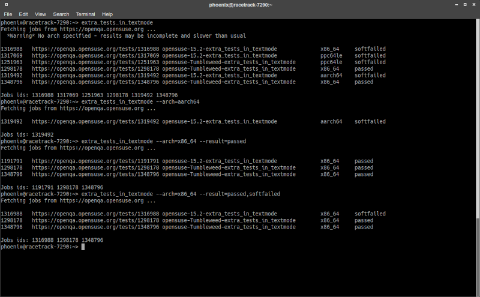

# openqa-jobs

Utility to list latest openQA jobs for a given test (e.g. `extra_tests_in_textmode`)

    ./openqa-jobs extra_tests_in_textmode
    
    ./openqa-jobs --instance "https://openqa.suse.de" --distri sle --flavor Server-DVD-Updates --arch=x86_64 mau-extratests

## Install

    make install
    make install-script SCRIPT_DIR=~/bin            # replace ~/bin if necessary

Ensure `$SCRIPT_DIR` is in your `PATH` variable.

### Install main script

Install script to `/usr/local/bin` (or custom `INST_DIR` directory)

    make install
    make install INST_DIR=/usr/local/bin

### Helper scripts

There are some helper scripts (see [bin](bin) directory) to make access to the most used test queries easier:

* `extra_tests_in_textmode`
* `mau-extratests`
* `mau-extratests-docker`
* `mau-filesystem`

Helper script are by default installed to `$HOME/bin`. Set the `SCRIPT_DIR` variable to install them to a custom directory:

    make install-scripts
    make install-scripts SCRIPT_DIR=~/bin

**Important**: Ensure `$HOME/bin` is in your `PATH` ([more information](https://opensource.com/article/17/6/set-path-linux))

Then you should be able to list the corresponding tests by running them from your terminal.

